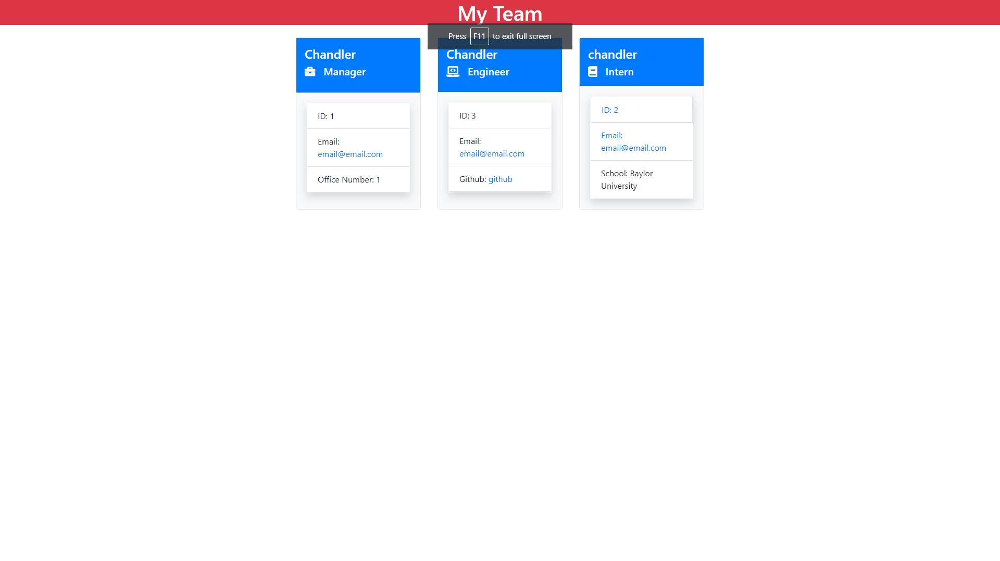

# team-Profile-Generator

## Table of Contents:

[Description](#description)
[Installation Instructions](#installation-instructions)
[Test](#test)
[Images](#images)
[License](#license)
[Contributors](#contributors)
[Questions](#questions)

## Description

A node.js application that allows the user to input employee data and generate a styles HTML file with each employee's information

## Installation Instructions

Clone the repository for this project. Install npm inquirer and jest to run the application. Open the command line terminal for the application.

## Test

type [node index.js] into the terminal to begin

## Images/Video

Image of completed HTML

Link to Video Demonstration
https://drive.google.com/file/d/1G2-N9M-2JpKFIX-V3rfH1YV1q6Ja9kmS/view

## License

## Contributors

Chandler Green

## Questions

Here are my email address and Github username if there are any questions

email: chandlergreen1997@gmail.com
Github: (https://github.com/axeliono)
